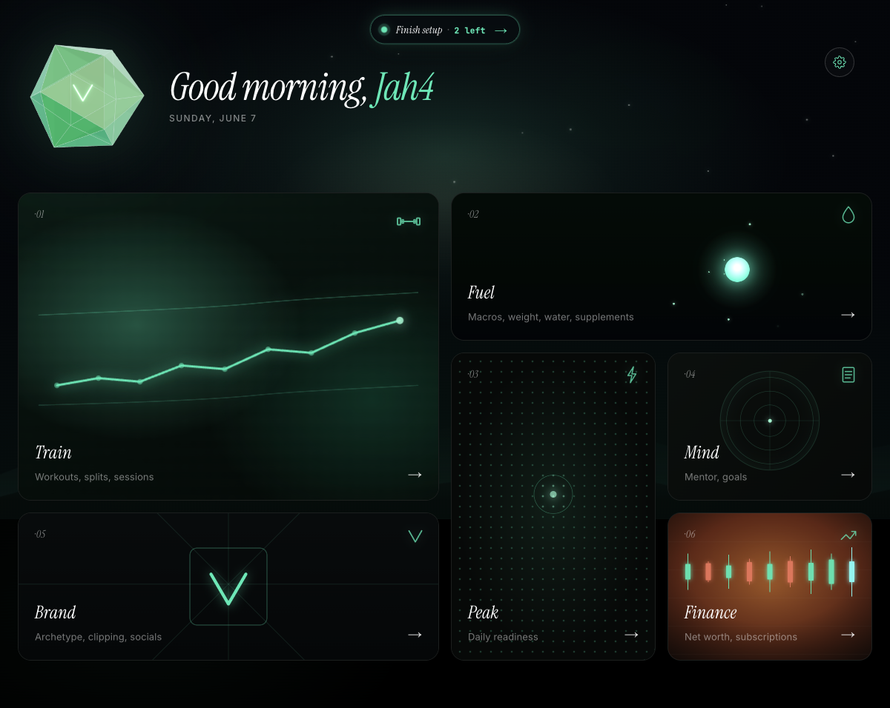
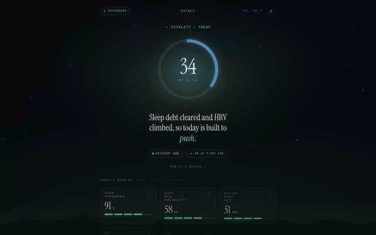
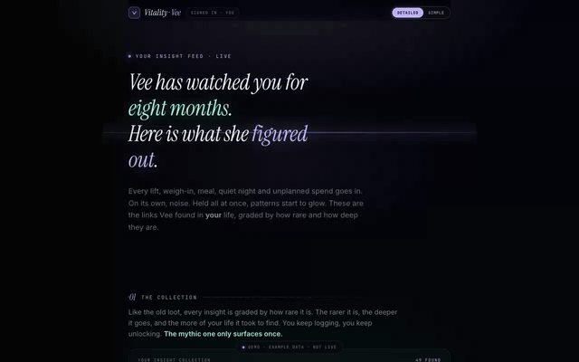
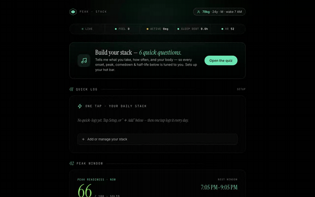
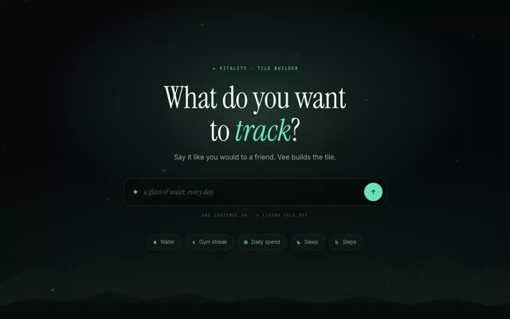
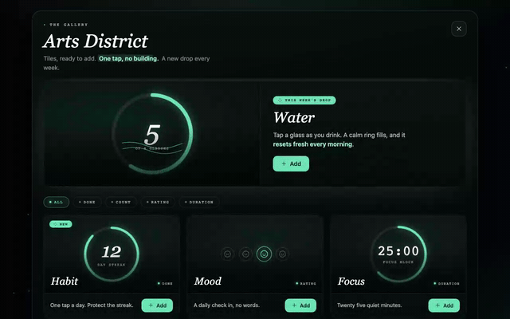

# Vitality

**An open-source life dashboard.** A multi-user Next.js app that turns your health, training, nutrition, goals, and finances into one calm, beautiful dashboard — with a wearable-agnostic daily Vitality score, deep workout intelligence, and an AI mentor that can build new dashboard tiles for you.

<p align="center">
  
</p>

<p align="center">
  <a href="https://ohwisey.github.io/vitality-oss/">Website</a> ·
  <a href="#set-it-up-with-an-ai-agent">AI setup</a> ·
  <a href="#quickstart-manual">Manual setup</a> ·
  <a href="#the-modules">Modules</a> ·
  <a href="#connect-claude-to-your-dashboard-mcp">MCP</a> ·
  <a href="LICENSE">MIT</a>
</p>

---

## Two ways to get running

**1 · One prompt (recommended).** Paste this into Claude Code, Codex, Cursor — any coding agent with a terminal — from any empty folder:

```
Clone https://github.com/ohwisey/vitality-oss and follow its SETUP-PROMPT.md exactly —
set everything up, run it, and help me sign up.
```

[`SETUP-PROMPT.md`](SETUP-PROMPT.md) is a complete provisioning brief: the agent checks your machine, clones the repo, creates and links a Supabase project, applies all 77 migrations, writes `.env.local`, boots the dev server, helps you sign up, and — if you want — deploys to Vercel. It only stops to ask for things it genuinely can't create itself (your Supabase login, optional API keys). Already cloned? Just say *"read SETUP-PROMPT.md and set this up for me."*

**2 · Do it by hand.** ~10 minutes. See [Quickstart](#quickstart-manual) below.

Either way, the only hard requirement is a free Supabase project. **Every other integration is optional and degrades gracefully** — features without a key say they aren't configured instead of breaking.

## The modules

> The clips below are captured from the interactive demo pages the app itself ships and links to (`public/*.html`) — open them in a browser and play with them before you even set up the app.

### Vitals — one calm number



One 0–100 read of how your body is doing today, built from whatever you have — a WHOOP, an Oura, an iPhone, a screenshot, or thirty seconds of honest self-report.

- The daily score fuses six weighted signals — recovery, sleep performance, HRV vs baseline, resting heart rate vs baseline, sleep hours, strain balance — and when a reading is missing, the remaining weights re-normalize so a gap lowers *confidence*, not the score ([lib/vitals/score.ts](lib/vitals/score.ts)).
- Data can arrive five ways and all land in the same pipeline: WHOOP/Oura OAuth sync, Fitbit, an iOS Shortcut posting Apple Health numbers, a Claude-powered importer that reads a *screenshot of any fitness app*, and a no-device check-in ([lib/vitals/wearables.ts](lib/vitals/wearables.ts), [lib/wearables/extract.ts](lib/wearables/extract.ts)).
- HRV and RHR are judged against **your own rolling baseline** (up to 90 days), never population norms — and goal targets are sized from that baseline too ([lib/vitals/readings.ts](lib/vitals/readings.ts)).

*WHOOP data crosses a strict trust boundary: provisional early-morning numbers are never stored as truth, and webhooks are verified with timing-safe HMAC signatures ([lib/whoop/webhook.ts](lib/whoop/webhook.ts)).*

### Fitness — a logger that remembers

A workout logger that remembers your last session, sizes today around your goal, and treats light weeks as part of the plan.

- Rep prescriptions bend to your goal: the same heavy day reads 4×6 for a strength goal and 3×13 for longevity, with a reps-in-reserve target per set ([lib/training/repZones.ts](lib/training/repZones.ts)).
- The finish screen judges each lift against your last session of the same split day — 60% top-set estimated 1RM, 40% total volume — and a heavier top set always counts as a new best ([lib/workouts/sessionVerdict.ts](lib/workouts/sessionVerdict.ts)).
- Deloads span one pass through your split (half the sets, ~10% lighter) and eased sessions are excluded from PR math, so a light day never dents your baseline ([app/app/fitness/log/actions.ts](app/app/fitness/log/actions.ts)).
- A weekly volume audit credits working sets per muscle and flags any muscle your program leaves below minimum effective volume ([lib/training/volumeAudit.ts](lib/training/volumeAudit.ts)).

*Mid-session edits survive iOS killing the tab: a synchronous localStorage snapshot lands before every network save, and on reload the logger folds only the sets the server is missing back in ([lib/workouts/pendingSnapshot.ts](lib/workouts/pendingSnapshot.ts)).*

### Fuel — nutrition without guessing

Log food by photo, barcode, or search — then let the scale, not a formula, steer your calorie target.

- Photo scans where the AI is **not allowed to guess calories**: Claude identifies foods and portions, but every macro number comes from a USDA lookup — with a plausibility check that rejects any match denser than 902 kcal/100g, the physical ceiling of pure fat ([lib/nutrition/usda.ts](lib/nutrition/usda.ts), wired into the scan at [app/api/nutrition/parse-meal/route.ts](app/api/nutrition/parse-meal/route.ts)).
- The scanner learns your kitchen: your last 40 corrections are injected as priors on the next scan, and it asks at most 2 clarifying questions — only when the answer would swing the meal by more than 50 kcal ([lib/nutrition/prompt.ts](lib/nutrition/prompt.ts)).
- An adaptive coach computes your real maintenance from your own weigh-ins and food log (28-day least-squares trend), waits for 10 weigh-ins before suggesting anything, and nudges at most 250 kcal per week ([lib/nutrition/adaptive.ts](lib/nutrition/adaptive.ts)).
- Barcode scanning via the browser's native BarcodeDetector against Open Food Facts, and a water target that scales with your actual medications and habits ([app/app/fuel/water/substances.ts](app/app/fuel/water/substances.ts)).

### Goals — Vee only speaks when it's true



Say a goal in your own words; Vee tidies it, wires it to the real data behind it, and only speaks when it has something true to say.

- Type *"i wanna get a 3 plate bench"* and AI triage returns a clean title and category — with a deterministic fallback so saving never blocks on a model ([lib/goals/categorize.ts](lib/goals/categorize.ts)).
- Drift detection only notices a slip from something you *actually did* — training needs 3+ workouts in the last 21 days gone quiet — and surfaces at most one nudge at a time ([lib/goals/drift.ts](lib/goals/drift.ts)).
- The goal guide can name the hidden weakness capping you: if your bench goal is climbing but a triceps lift has stalled 3+ weeks, it calls out that lift — and returns nothing rather than invent a weakness that isn't in the data ([lib/insights/goalGuide.ts](lib/insights/goalGuide.ts)).
- Trend numbers only render when a real metric backs them, with word-bound matching so "**Close** more deals" never binds to the bathroom scale through the "lose" inside "Close" ([lib/insights/ticker.ts](lib/insights/ticker.ts)).

### Peak — energy, forecast hourly



An hour-by-hour forecast of your energy — from your circadian rhythm, your recovery data, and what you actually consumed — that places your day's tasks where the energy will be.

- Each dose you log is modeled with real pharmacokinetics — onset, peak, exponential half-life decay, scaled by dose, tolerance, and bodyweight — across a 20+ substance library from espresso to melatonin ([app/app/peak/curve.ts](app/app/peak/curve.ts)).
- Recovery bends the whole curve: WHOOP recovery, sleep debt, and strain damp specific hours after waking, with non-physiological readings rejected ([app/app/peak/curve.ts](app/app/peak/curve.ts)).
- Tasks auto-place by difficulty — hard work lands on the highest-energy free slot, easy admin parks in the dips — and the parser understands *"class 1145 to 4pm hard"* ([app/app/peak-tracker/planner.ts](app/app/peak-tracker/planner.ts)).

*The score is fully auditable: a drivers panel attributes every point of today's number to a named source, so "why is my score 72" always has an itemized answer.*

### Finance — money on one quiet page

Net worth, subscriptions, and live markets — where a screenshot of a statement becomes structured data you approve before it lands.

- Photograph a bank statement, billing page, or receipt and Claude extracts it into an editable preview — every row is reviewable before anything saves, and the extractor treats text in the image as data, never instructions ([app/api/finance/import-statement/route.ts](app/api/finance/import-statement/route.ts)).
- The subscription radar surfaces free trials converting to paid within 14 days, flags price hikes against the stamped previous price, and lays upcoming bills on a 30-day timeline ([app/app/finance/state.ts](app/app/finance/state.ts)).
- Stock quotes (Finnhub) and crypto (CoinGecko) flow through server-side proxies with a 15-minute deployment-wide cache — a popular ticker costs one upstream call no matter how many users hold it ([app/api/finance/quote/route.ts](app/api/finance/quote/route.ts)).

*Auto-deduct renewals are a pure, idempotent state transform — capped at one billing cycle per pass, so a months-stale renewal date under-charges safely instead of storming the balance.*

### Brand — for people who publish

Every venture you're building on one page — its cadence, its numbers, and its money.

- Describe what you're building in a sentence and AI intake maps it to one of eight archetypes (creator, shop, trades, indie product…) and pre-fills schedules, accounts, and KPIs ([app/app/brand/archetypes.ts](app/app/brand/archetypes.ts)).
- One-tap refresh pulls YouTube subscribers and lifetime views from the Data API, and reads TikTok followers straight off the public profile page — no OAuth, no paid scraper ([app/api/brand/refresh/route.ts](app/api/brand/refresh/route.ts)).
- The on-demand business read has Claude *visit the public pages you've linked* (storefront, profile) via web fetch, and requires the advice to be grounded in something it actually saw ([app/api/brand/insight/route.ts](app/api/brand/insight/route.ts)).
- Each brand keeps a small P&L whose recurring expenses two-way sync with the Finance module's subscriptions ([app/app/brand/financeBridge.ts](app/app/brand/financeBridge.ts)).

### Forge & the Arts District — tiles anyone can make



Anyone can make a dashboard tile — by hand in the Forge, through Claude over MCP, or from another maker's gallery — and every one enters through the same sealed gate.

- A no-free-text tile builder: six bounded shapes (tally, timer, rating, measure, money, habit) plus a 28-preset library, rebuilt through a deterministic server build ([app/app/create/TileBuilder.tsx](app/app/create/TileBuilder.tsx)).
- Bring any AI: the Forge hands you a universal build brief, and when a returned tile fails the upload gate, the verdict is a *fix brief written for the builder AI* — your whole job is paste it back ([lib/tiles/forgePrompt.ts](lib/tiles/forgePrompt.ts)).
- Every tile is linted against a hard floor — 60fps transform/opacity-only animation, no network calls, sealed HTML — plus a richness gate that catches hollow tiles ([mcp/src/tiles/lintTile.ts](mcp/src/tiles/lintTile.ts)).



Community tiles publish to the **Arts District** and to public maker pages at `/u/username` — visitors see a recolorable SVG poster instead of the sealed HTML, and one tap installs the tile onto their own dashboard ([app/u/[username]/MakerGallery.tsx](app/u/%5Busername%5D/MakerGallery.tsx)).

## Connect Claude to your dashboard (MCP)

Vitality ships a hosted MCP server — 34 tools behind OAuth 2.1 with PKCE and a real consent screen. Connect claude.ai, Claude Desktop, or Claude Code to your deployment and ask about your data, or have Claude build and publish a new tile onto your dashboard, live. Each request mints a short-lived, row-level-security-scoped database session, so one stateless process serves many users safely ([app/api/mcp/](app/api/mcp/), [mcp/](mcp/)).

It's off by default (`MCP_ENABLED=false`) and a basic deploy never needs it.

## Set it up with an AI agent

Open the repo in **Claude Code** (or Codex, or any coding agent with a terminal) and say:

```
Read SETUP-PROMPT.md and set this app up for me.
```

[`SETUP-PROMPT.md`](SETUP-PROMPT.md) walks the agent through preflight checks, Supabase provisioning + migrations, `.env.local`, first boot, a signup smoke test, and an optional Vercel production deploy — including exactly which questions to ask you and which keys are optional.

## Quickstart (manual)

```bash
git clone https://github.com/ohwisey/vitality-oss.git
cd vitality-oss
pnpm install

# Supabase (free tier is fine): create a project at https://supabase.com/dashboard
supabase login
supabase link --project-ref <your-project-ref>   # no config.toml needed — migrations ship in the repo
supabase db push       # applies supabase/migrations/ (77 migrations: schema, RLS, signup trigger)

cp .env.example .env.local   # fill in the three Supabase values (URL, anon, service role)
pnpm dev                     # http://localhost:3000 → sign up at /signup
```

Two first-run notes:

- **Email confirmation:** the signup flow expects Supabase's "Confirm email" to be OFF (dashboard → Authentication → Sign In / Up → Email). Alternatively, `node scripts/create-test-user.mjs` creates a fully-onboarded test login (`stripe-test@vitality.test` / `test1234`) using the service-role key, no email involved.
- The pnpm warning `Ignored build scripts: @sentry/cli…` is expected and harmless.

### Optional integrations

| Feature | What you need |
|---|---|
| AI mentor, food-photo analysis, tile Forge | `ANTHROPIC_API_KEY` |
| WHOOP | Users bring their own WHOOP dev app in-app; you only set the callback URL |
| Oura / Fitbit | One shared OAuth app each (free dev accounts) |
| Nutrition search | Free USDA FoodData Central key |
| Stocks/crypto | Free Finnhub key / CoinGecko |
| Creator stats | YouTube Data API v3 key |
| Payments/tiers | Stripe keys (`scripts/stripe-bootstrap.mjs` sets up products) |
| Claude-to-dashboard MCP | `MCP_ENABLED=true` + JWT secrets (see `.env.example`) |

See [`.env.example`](.env.example) for the full annotated list.

## Tech stack

| Layer | Choice |
|---|---|
| Framework | Next.js 14 (App Router) + React 18 + TypeScript |
| Styling | Vanilla CSS with design tokens (no Tailwind) |
| Database/Auth | Supabase (Postgres + RLS + Auth) |
| Payments | Stripe (optional) |
| AI | Claude API (Anthropic) |
| 3D/Graphics | Three.js (landing hero) |
| Tests | Jest + Testing Library (185 suites — `pnpm test`) |
| Monitoring | Sentry (optional) |

## Repo tour

```
app/            Next.js App Router: pages, API routes (all third-party calls are server-side)
  app/          The signed-in dashboard and its modules (vitals, fitness, fuel, goals, ...)
  api/          Route handlers: wearables OAuth, AI endpoints, Stripe webhook, cron, MCP
components/     Shared React components (landing hero, quiz, gems, ...)
lib/            Domain logic: scoring, insights, nutrition, training, tiles, auth
engine/         The tile engine DNA — how single-file HTML tiles are built and linted
mcp/            The MCP tile-building toolkit + docs (its own package)
supabase/       SQL migrations (the entire schema, RLS policies included)
scripts/        Bootstrap and maintenance scripts (Stripe setup, test user reset)
workers/        Cloudflare email-ingest worker for wearable summary emails
public/         Static assets + the standalone HTML demos shown above
media/          The screenshots and clips used in this README
```

## Design rules (the short version)

1. Vanilla CSS only, tokens in `app/globals.css` — pure black background, mint accents, Inter.
2. Multi-user always: every query is scoped by RLS to the signed-in user.
3. API keys live server-side only — all third-party calls go through `/app/api/*` route handlers.
4. Tier gating happens on the server, never trusted from the client.

More in [CLAUDE.md](CLAUDE.md) (this repo is built to be pleasant to work on with AI coding agents) and [CONTRIBUTING.md](CONTRIBUTING.md).

## License

[MIT](LICENSE). Do whatever you want with it — run it for yourself, host it for friends, fork it into something new.
